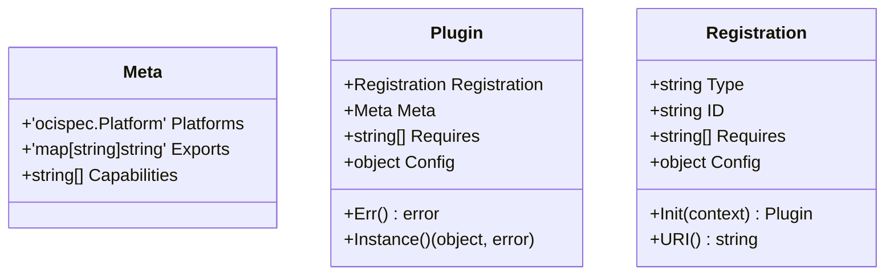

# 历史

- Docker Daemon从最初集成在docker命令中（1.11版本前），
- 独立成单独二进制程序（1.11版本开始）2016.12
    - containerd是容器技术标准化之后的产物，为了能够兼容OCI标准，从Docker Daemon剥离
    - containerd分v0.2.x ， v1.x版本
        - v0.2.x 由docker daemon集成
        - v1.x 开始支持oci标准
    - containerd项目地址： github.com/docker/containerd
- containerd捐献给cncf 2017.03
    - 项目地址修改为 github.com/containerd/containerd
    - v1.0.0正式版发布 2017.12 支持OCI接口
    - v1.1.0正式版 2018.4 支持CRI接口
    - v1.2.0正式版 2018.10 runtime v2稳定
- shim
    - shim是一个真实运行的容器的真实载体

# 架构

- 组件如图


# glossary

- 服务： 提供grpc服务
    
- sandbox：一种特殊容器，主要作用准备容器隔离的环境，包括网络，io目录，cgroup parent
    
- container：业务容器，每个进程都由一个task 管理
    
- shim：管理器(containerd) 和 runtime的粘和层，因为runc是二进制文件执行，无法常驻内存，使用shim一方面方便管理，另一方面扩展runtime; shim管理 sandbox + container(s)
    
- task：代表进程+io
    
- runtime v2: 可以理解 task 管理器
    

# 服务

- 每个服务都是plugin方式加入，包括不限于image, runtime, grpc server等
- plugin特点
    - 插件URI为 Type+ID，如 `io.containerd.snapshotter.v1.overlayfs`，io.containerd.snapshotter.v1是Type，overlayfs是ID
    - 插件类型之间有依赖, 从下向上排序：
        - ContentPlugin， SnapshotPlugin
        - MetadataPlugin
        - GCPlugin，RuntimePlugin，DiffPlugin
        - ServicePlugin
        - InternalPlugin，GRPCPlugin
- 数据结构



## diff 插件

- 用于snaphost的操作
- diff/walking/plugin目录， DiffPlugin类型，依赖MetadataPlugin
- 提供两个方法
    - `Compare` 根据提供的 lower，upper 信息，得到oscispec.Descriptor
    - `Apply` 从镜像压缩文件中读取内容，并按序执行多个处理器，主要是校验，解压，自定义插件等

## scheduler

- 调度器，gc/scheduler目录， GCPlugin类型，依赖MetadataPlugin
- 配置信息
    - PauseThreshold: 暂停阈值，平均每秒2%的暂停时间，使用该值计算下次等待周期，默认为0.02, 最大值0.5
    - DeletionThreshold：删除阈值，在删除多少次之后至少保证发生gc调度，0表示不会被删除触发，默认0
    - MutationThreshold： 突变阈值
    - ScheduleDelay：调度延迟，当发生手动触发或者阈值触发后，延迟多久才开始GC，默认0ms
    - StartupDelay： 慢启动，默认100ms
- goroutine
    - gc实际是执行content.GarbageCollect

## monitor

- 容器的起停状态同步， InternalPlugin类型，依赖ServicePlugin
- goroutine
    - 过滤标签 `containerd.io/restart.status`的container
    - 对比container和预期状态是否相符
    - 重新执行start或stop

## cgroup

- 进程oom监听和指标统计，在 metrics/cgroup 目录， TaskMonitorPlugin类型
- 作用：task的指标和oom监听
- 主要是shim 在使用该模块，shim需要监听 task 是否发生OOM

## runtime v1

- 容器进程管理器,， RuntimePlugin类型，依赖MetadataPlugin
- 配置
    - shim： shim二进制文件地址
    - runtime： 被shim使用的runtime二进制文件地址
    - no_shim： 直接调用runtime，跳过shim
    - shim_debug： 是否打开shim调试

## runtime v2

- 容器进程管理器, RuntimePluginV2类型，依赖MetadataPlugin
- 在[client](https://github.com/containerd/containerd/blob/34fb8d8967595292adce04b53b12ee33499cd6b8/client.go#L102)中被配置为默认的runtime
- 初始化时会执行以下内容
    - 创建目录 {root/state}/io.containerd.runtime.v2.task
    - 读取 {state}/io.containerd.runtime.v2.task目录
    - 恢复shim 管理

```
tips：
fifo文件ro打开：当无写端，若是nonblocking模式，则返回，否则阻塞
fifo文件wo打开：当无读端，返回ENXIO，若读端关闭时写数据，则返回SIGPIPE
fifo文件rw打开：总是成功
```

## snapshot

- 容器的rootfs管理器，SnapshotPlugin类型
- linux 平台
    - snapshots/{native, overlay, devmapper，btrfs}
    - containerd/{aufs,zfs}
- windows平台
    - snapshots/{lcow, windows}

```bash
# man 8 mount
# references: https://wiki.archlinux.org/title/Overlay_filesystem
tips:
1 overlay 挂载
mount -t overlay  overlay -o lowerdir=/lower:/lower2,upperdir=/upper,workdir=/work  /merged
// upperdir 一般是可写层
// workdir 空目录，
2 devmapper 挂载
mount -t ext4 /dev/mapper/xx {target}
3 native 挂载
mount -t bind {src} {dst}
4 btrfs 
mount -t btrfs 
```

# services

- 提供rpc服务和数据库操作等
- services/目录下，具体有以下的内容

## container, image, lease, namespace 服务：

- local.go: 是service Plugin类型，对数据库的操作，以及event的发送
- service.go: 是grpc Plugin类型，提供grpc服务，并使用local内相同接口

## content 服务

- service.go: 提供grpc服务，CRUD content数据
- contentserver : content具体操作(content)

## task 服务

- local.go: 调用runtime v2同名接口，包括容器创建，开始，结束，删除，终端，状态等信息
- server.go: 提供grpc服务

## diff 服务:

- local.go: 使用diff插件
- service.go: 提供grpc服务

## event服务：

- service.go: 提供grpc服务，包括转发，推送，订阅功能

## introspection 服务:

- service.go: 提供grpc服务，列举注册的plugin

## healthcheck 服务：

- service.go: 提供 grpc服务，检查指定服务的健康

## version服务：

- service.go: 提供 grpc服务，检查containerd version

## opt服务：

- 配置目录 root
    - 添加 {root}/bin 到环境变量 PATH中
    - 添加 {root}/lib 到环境变量LD\_LIBRARY\_PATH中

## server

- 基础plugin，扩展插件的初始化和服务启动
    - 流程
        - 注册 ContentPlugin插件
        - 注册 MetadataPlugin插件
        - 注册 proxy插件(ContentPlugin或SnapshotPlugin类型)
        - 注册DiffPlugin插件 (stream processor类型)，目前主要是处理 加密的镜像
    - 监听event类型
        - /tasks/oom
        - /images/

```toml
version = 2
root = "/var/lib/mycontainerd" #持久化目录
state = "/var/run/mycontainerd" #非持久化目录
oom_score = 0 # containerd的oom分数
...
[proxy_plugins]
  [proxy_plugins.stargz]
    type = "snapshot" #支持snapshot和content类型
    address = "/run/containerd-stargz-grpc/containerd-stargz-grpc.sock"
[stream_processors]
  [stream_processors."io.containerd.ocicrypt.decoder.v1.tar.gzip"]
    accepts = ["application/vnd.oci.image.layer.v1.tar+gzip+encrypted"]
    returns = "application/vnd.oci.image.layer.v1.tar+gzip"
    path = "/usr/local/bin/ctd-decoder"

[cgroup]
  path = "" # containerd 所在路径，去除 ‘/sys/fs/cgroup/'前缀的
[plugins]
  [plugins."io.containerd.gc.v1.scheduler"]
    pause_threshold = 0.02
    deletion_threshold = 0
    mutation_threshold = 100
    schedule_delay = "0s"
    startup_delay = "100ms"
  [plugins."io.containerd.internal.v1.restart"]
    interval = "10s" #restart插件，遍历container的周期
  [plugins."io.containerd.metadata.v1.bolt"]
    content_sharing_policy = "shared" #content策略，shared则所有不同ns的都可以访问，另一种是isolated
  [plugins."io.containerd.monitor.v1.cgroups"]
    no_prometheus = false
  [plugins."io.containerd.runtime.v1.linux"]
    shim = "containerd-shim"
    runtime = "runc"
    runtime_root = ""
    no_shim = false
    shim_debug = false
  [plugins."io.containerd.runtime.v2.task"]
    platforms = ["linux/amd64"] #镜像支持的平台类型
  [plugins."io.containerd.service.v1.diff-service"]
    default = ["walking"] #walking是内置的diff插件
```

# cri

- GRPCPlugin类型，依赖ServicePlugin
- 作用: 提供cri接口， cri 常见配置

```toml
[plugins.cri]
    disable_tcp_service = true
    stream_server_address = "127.0.0.1" # unix 监听地址
    stream_server_port = "0" # unix 监听端口,0是随机分配
    stream_idle_timeout = "4h0m0s" #idle连接超时时间
    enable_selinux = false 
    sandbox_image = "hub.easystack.io/captain/pause-amd64:3.0"
    stats_collect_period = 10 #单位秒，snapshot状态收集
    systemd_cgroup = false #只适用io.containerd.runtime.v1.linux
    enable_tls_streaming = false # 是否支持tls
    max_container_log_line_size = 16384 #单行日志最大byte
    disable_cgroup = false # 当rootless 运行时，需要设置为true
    disable_apparmor = false
    restrict_oom_score_adj = false
    netns_mounts_under_state_dir = false #将net ns设置到{state}/netns目录下,而不是默认的/run/netns下
    max_concurrent_downloads = 3
    unset_seccomp_profile = "" #seccomp配置文件
    disable_proc_mount = false #禁用k8s ProcMount， 对于k8s <= 1.11时，必须设置为true
    
      tolerate_missing_hugetlb_controller = true #1.5+,对于k8s <1.19,不支持配置hugetlb
      disable_hugetlb_controller = true #1.5+, 适用于rootless+cgroupv2+systemd
      ignore_image_defined_volumes = true #1.5+，创建container时，忽略image中定义的volume
    [plugins.cri.x509_key_pair_streaming] #stream tls配置
      tls_cert_file = ""
      tls_key_file = ""
    [plugins.cri.image_decryption] # 解密镜像，参考项目 github.com/containerd/imgcrypt
      key_model = none
    [plugins.cri.containerd]
      snapshotter = "overlayfs" #使用何种snapshot
      default_runtime_name = "runc" #默认runtime，必须出现在后续的列表中
      no_pivot = false #只适用io.containerd.runtime.v1.linux
        disable_snapshot_annotations = false #stargz snapshot需要配置
          discard_unpacked_layers = false #当执行content GC时，是否回收已经unpack的content
      [plugins.cri.containerd.default_runtime] #被弃用
        privileged_without_host_devices = false # 设置特权模式下时，是否映射主机上设备到容器内
      [plugins.cri.containerd.untrusted_workload_runtime] #被弃用
        privileged_without_host_devices = false
      [plugins.cri.containerd.runtimes]
        [plugins.cri.containerd.runtimes.runc]
          runtime_type = "io.containerd.runc.v2" #将被用于解析为具体二进制文件名
          [plugins.cri.containerd.runtimes.runc.options]
        # NoPivotRoot disables pivot root when creating a container.
            NoPivotRoot = false
        # NoNewKeyring disables new keyring for the container.
            NoNewKeyring = false
        # 设置shim cgroup目录，默认是和containerd一起
            ShimCgroup = ""
        # 设置shim log user id.
            IoUid = 0
        # 设置shim log group id.
            IoGid = 0
        # 设置二进制文件名，否则将使用type字段
            BinaryName = ""
        # runc的目录，默认为 {state}/runc.
            Root = ""
        # criu 二进制文件路径.
            CriuPath = ""
        # 使用cgroup的systemd 驱动，注意需要和kubelet中同样设置
            SystemdCgroup = true
        # CriuImagePath is the criu image path
            CriuImagePath = ""
        # CriuWorkPath is the criu work path.
            CriuWorkPath = ""
          privileged_without_host_devices = false
        [plugins.cri.containerd.runtimes.gvisor]
          runtime_type = "io.containerd.gvisor.v2"
          pod_annotations =[""]
          container_annotations = [""]
          base_runtime_spec="" # 文件绝对路径，且内容为oci runtime文件格式
        [plugins.cri.containerd.runtimes.firecracker]
         runtime_type = "io.containerd.firecracker.v2"
    [plugins.cri.cni]
      bin_dir = "/opt/cni/bin"
      conf_dir = "/etc/cni/net.d"
      max_conf_num = 1 #若有多个cni配置文件，则按照此值调用多个cni配置文件
    [plugins.cri.registry]
        config_path= /xxx # 目录，若配置该值，则以下内容被忽略
      [plugins.cri.registry.configs] #被弃用，使用config_path代替，在1.7后被移除
        [plugins.cri.registry.configs."hub.easystack.io"]
          [plugins.cri.registry.configs."hub.easystack.io".tls]
            insecure_skip_verify = true
      [plugins.cri.registry.mirrors] #被弃用，使用config_path代替，在1.7后被移除
        [plugins.cri.registry.mirrors."docker.io"]
          endpoint = ["https://registry-1.docker.io"]
        [plugins.cri.registry.mirrors."hub.easystack.io"]
          endpoint = ["https://hub.easystack.io"]
```

- 关于仓库目录配置方式

```
config_path= /opt/mycontainerd/hosts

# 目录内容
.
├── docker.io
│   └── hosts.toml
└── k8s.gcr.io
    └── hosts.toml

# hosts.toml内容
server = "https://k8s.gcr.io"

[host."https://k8s.gcr.io"]
  skip_verify = true
  capabilities = [ "pull", "resolve", "push" ]
  ca: "" #文件路径或文件内容
```


